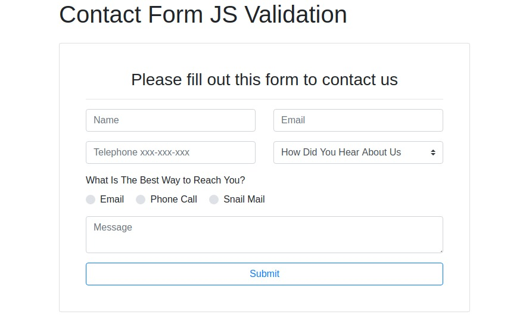

# contact-form-js-validation

The app requires the user enter their name, email address, and telephone number.
It also validates the user enter the correct format for their name and telephone number.
It was built using Vanilla JS and Bootstrap 4.

## Live Demo
[Click Here](http://apps.javierlona.com/contact-form-js-validation/)

## Installation
Clone/Download the repo then launch the index.html in a modern web browser.
